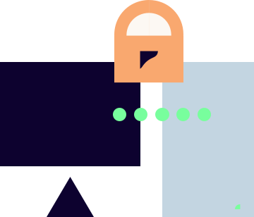

    

        <h1>Welcome!</h1>
        

            Here, system developers, infrastructure engineers, DevOps practitioners, and others at Bouvet will find information to support the operation, development, and maintenance of secure IT systems for our customers. The overarching content and themes discussed on these pages also supports project managers, advisors, and others who need to follow up on security in projects.
            The information on this site is by no means exhaustive on any subject, but aims to use simple language to describe various measures that covers the most common weaknesses.
        

    

    

        
        
"We will do our utmost to deliver the safest services and solutions"

    

    

    <h2 class="row devops-links-header">What are you looking for?</h2>
    

        <a href="introduction">
            Introduction
        </a>
        <a href="plan">
            Plan
        </a>
        <a href="design">
            Design
        </a>
        <a href="develop">
            Develop
        </a>
        <a href="deploy">
            Deploy
        </a>
        <a href="manage">
            Manage
        </a>
        <a href="security-champion">
            Security Champions
        </a>
    

    

        <h3>Information Security</h3>
        <b class="bottom-section-sub-header">is about securing these aspects of an IT system:</b>
        <b>Confidentiality</b>
        
The data processed by the system should not be accessible to unauthorized individuals.

        <b>Availability</b>
        
The functions offered by the system are available when users need them.

        <b>Integrity</b>
        
The data processed by the system is correct.

    

    

        

            <h3>Security Champion</h3>
            <b class="bottom-section-sub-header">Are you, or do you want to be a hero?</b>
            
A Security Champion is a person who acts as a driving force and motivator for security work in a team or department/unit. Responsibility for security lies with the team as a whole, but as a Security Champion, you contribute to awareness and focus within the team.

            

                A good place to start, whether you are or want to be a hero, is our
                <a href="/security-champion/" class="underlined-link"> info package for Security Champions</a>
            

        

    

