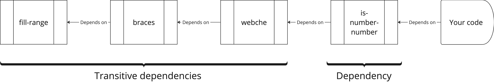

When we build software, we depend on a multitude of different third-party packages from ecosystems like npmjs, nuget, PyPi, or others. This is code "written by others," where we rely on these producing packages without major weaknesses and without malicious intent. Sources such as Gartner, Sonatype, and Snyk have estimated that as much as 90% of the code in a typical development project may consist of such third-party packages, so the risk is significant if we do not have control.

An important tool is to conduct a so-called Source Composition Analysis - SCA to get an overview of the packages we use, both direct and indirect (transient) dependencies, as well as the risks associated with them.

## Security Risks
There are several security risks associated with third-party packages, but unfortunately, the ecosystems for such packages are not very proactive on the security front. Infected packages that are identified are removed, but for those using automation to keep dependencies updated to the latest version, this is often too late.

### Vulnerabilities
They may contain known vulnerabilities ([CVE](https://cve.mitre.org)) that can be exploited. Some of these can be mitigated by upgrading the packages to the latest version, while others have more fundamental challenges that can be mitigated in other ways. Sometimes, some CVEs are created for weaknesses that are technically a vulnerability but are _'by design'_. An example of this is the Python package _Pandas_ which among others has the vulnerability [CVE-2020-13091](https://cve.mitre.org/cgi-bin/cvename.cgi?name=CVE-2020-13091). This allows users to deserialize files without checking where they come from - this has been registered as a vulnerability as it could be exploited if other measures are not in place.

### Malicious Code
The packages we download and use run in the same context as our code and can use the same resources and accesses it has. The content of the packages we consume is entirely beyond our control, and if one of them contains malicious software (malware), the consequences can be significant.

In recent years, there have also been examples of packages often referred to as "protestware," as they contain logic that performs actions if users can be geolocated to specific countries. The package "[peacenotwar](https://en.wikipedia.org/wiki/Peacenotwar)" is one such example, which was added as a dependency to ```node-ipc```, a widely used package. This resulted in ```peacenotwar``` also being downloaded by many users; those geolocated to Russia or Belarus had data deleted and were subjected to DOS attacks via the package.

Whether something is meant as malware or protestware, the consequences are serious, and all development projects should have measures in place to limit risk and consequences in case an incident occurs.

### Use of CDN
Content-delivery-networks to distribute Javascript libraries have been used by many as an easy way to include these in the code without having to include them in the build or deploy process. The idea is good, but you then have a direct dependency on a source you have no control over, which can be [abused to spread malware](https://sansec.io/research/polyfill-supply-chain-attack).

### License Model
There are many different license models for available components; some are completely free and impose no requirements for use, while others like AGPL and GPL can have significant consequences for what you develop. Most ecosystems also allow the use of proprietary licenses, which can limit what you can use a package for without a valid license. Some have specific requirements in the license, others are free for personal use but require you to purchase a license if used commercially.

## How Do We Secure Ourselves?
To protect the system against these threats, there are several effective measures we can take. Many of these are already covered elsewhere, but there are still some threats unique to external packages.

### Threat Model and Complexity
In many cases, we depend on many packages that we do not use directly, so-called transitive dependencies. Each package in a solution represents an increase in complexity and attack surface, increasing the chance that something will go wrong at a later stage.



An important question everyone must ask is _"do we need this package?"_ What is the cost of creating the functionality ourselves compared to the risk and complexity associated with adding it?

### Monitoring Dependencies
An important tool is analysis tools that help us control vulnerabilities and risks in our dependencies. There are many actors on the market, ranging from simple ones like GitHub's Advanced Security with Dependabot to more advanced ones like Snyk and Sonatype. In many cases, the data basis for the solution makes the big difference, but there are also a number of useful features to consider:

* Policy Management - Sonatype tags all packages with metadata, allowing you to define policies that dictate what can be used or not.
* Automatic Remediation - Tools like dependabot (GitHub) automatically upgrade packages when vulnerabilities are discovered, and updates are available.
* Integrations and Notifications - Many tools like Snyk SCA can integrate into IDEs and CICD.
* Risk Overview - Many solutions provide an overall view where you can see the total risk picture for individual applications or larger parts of the portfolio.

### Maturity
This can be difficult to quantify, but how active is the community around a package? Is it maintained by individuals, groups of developers, or does it have economic or other support from a company?

How likely is it that the package will still be maintained in, for example, 5 years? How is the history in terms of vulnerabilities and quality; is there an active community reporting weaknesses that are then addressed, or do reported issues linger in limbo for extended periods? Tools like [libraries.io](https://libraries.io) and [Security Scorecard](https://securityscorecard.com/) can be useful for finding out more.

### Pinning Versions
One attack vector is when malicious actors take over popular packages and publish their own version with malicious content. If we have build or deploy processes that fetch the latest version of dependencies each time, they will automatically fetch the infected package. A measure here can be to pin the package versions we use, for example, in ```package-lock.json``` or similar.

### Use of SBOM
Software Bill Of Materials (SBOM) is an approach where we generate an overview of all dependencies with versions from our solutions. There are several more or less standardized file formats for this, which can also be archived or included in other solutions to simplify central monitoring.

## More Information
* [Sonatype: State of the software supply chain](https://www.sonatype.com/state-of-the-software-supply-chain/introduction)
* [Wikipedia: Source Composition Analysis](https://en.wikipedia.org/wiki/Software_composition_analysis)
* [Example of CDN attack: Polyfill supply chain attack hits 100K+ sites](https://sansec.io/research/polyfill-supply-chain-attack)
* [Example of compromised library: xz-Utils](https://arstechnica.com/security/2024/04/what-we-know-about-the-xz-utils-backdoor-that-almost-infected-the-world/)
