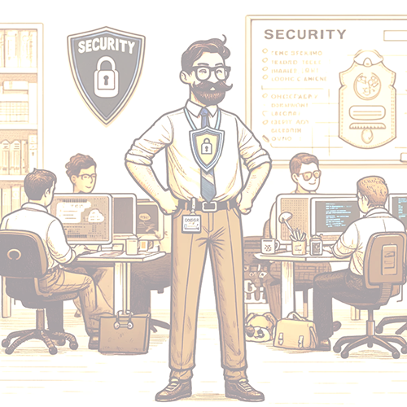

    

        
 
            A Security Champion is a cross-functional consultant who works actively in the delivery process to draw attention to security issues, ensuring that any problems or challenges can be raised and prioritized alongside other work. The delivery manager holds the formal responsibility for security, but Security Champions are expected to collaborate closely with them on tasks related to security.
        

    

    

        
    

