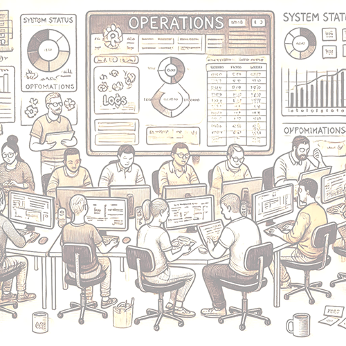

    

        

            Når løsningen er designet, utviklet og deployet starter en annen jobb som for mange kanskje er litt fremmed: Forvaltning. Uavhengig av hvor mye utvikling som skjer, har vi likevel et ansvar for å forvalte det vi ruller ut i produksjon (eller til andre miljøer). 
        

        

            Disse må monitoreres, vi må sikre at vi har jevnlige backups _som også må testes_, at vi har oppdaterte planer for disaster recovery, følger opp sårbare avhengigheter og mye annet. 
        

    

    

        
    

