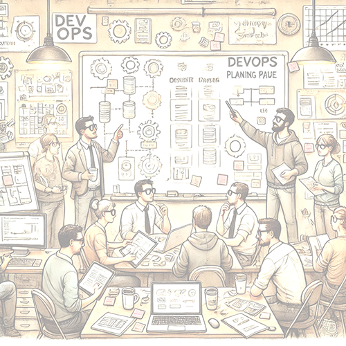

    

        

            Det viktigste vi kan gjøre før vi skriver en eneste kodelinje er å blie enige om ansvarsfordelingen mellom oss og kunden, samt klassifiseringen av løsning og data: Hvilke krav stiller kunden og hvilke krav kommer fra lovverk eller andre parter? Kompetanse innenfor applikasjonssikkerhet (AppSec) bør være på banen allerede i denne fasen for å sikre at en ivaretar krav og forventninger til sikkerhet.
        

        

            Vi må også vite hva vi gjør ~~dersom~~når det oppstår en sikkerhetshendelse - hvilke krav står vi ovenfor, hva må til for at disaster recovery, backup og liknende skal lykkes, og hva vil konsekvensene av nedetid være for kunden? 
        

    

    

        
    

