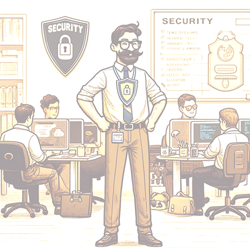

    

        
 
            En Security Champion er en person som fungerer som en pådriver og motivator for sikkerhetsarbeidet i et team eller en avdeling/enhet. Ansvaret for sikkerheten ligger på teamet i sin helhet, men som Security Champion bidrar du til bevisstgjøring og fokus.
        

        

            Enkelt forklart så er en Security Champion en ambassadør for sikkerhet, teamets sikkerhetssamvittighet.
        

    

    

        
    

