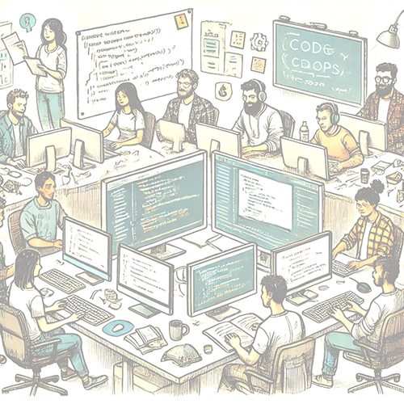

    

        

            Det er ikke mulig å gi en oppskrift på hvordan man skriver sikker programkode i noen få, enkle og kortfattelige artikler. Det betyr derimot ikke at det er en uoverkommelig oppgave forbeholdt sikkerhetseksperter! Alle som utvikler programvare i Bouvet skal være kjent med <a href="https://owasp.org/www-project-top-ten/">OWASP Top 10</a>, som er et godt utgangspunkt for å bli kjent med hvilke utfordinger man står ovenfor som utvikler.
        

        

            Artikklene du finner under temaet <b>Utvikle</b> på denne siden vil fokusere på det som foregår på en utviklers arbeidsmaskin, som ikke er konkret kode. De vil ikke gå i dybden på konkrete angreps metoder eller hvordan beskytte mot disse. Du vil også finne råd om hvordan et team bør arbeide for å være i stand til å forebygge, identifisere, og fikse sårbar kode.
        

    

    

        
    

