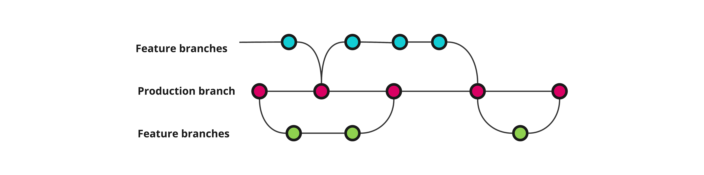

# Verktøy brukt i leveransen
:::tip Kort oppsummert
Feilkonfigurasjon er en vanlig kilde til feil og sårbarheter, dette gjelder også for verktøy. Dersom mulig bør teamet standardisere på bruk av verktøy og utvidelser til disse, og sikre at alle har en mest mulig lik (og dokumentert) arbeidsprosess.
:::

Alle utviklingsteam benytter ulike verktøy i utviklingsprosessen, og utvalget vil varierere fra team til team avhengig av personlige preferanser, teknologivalg, system og kundekrav og mye annet. 

Et typisk team vil benytte seg av en eller annen form for
* [IDE](https://en.wikipedia.org/wiki/Integrated_development_environment)
* et system for versjonskontroll av koden, typisk _git_
* et verktøy for [CI/CD](https://en.wikipedia.org/wiki/CI/CD) som kan utføre ulike oppgaver relatert til bygging, testing eller deployment
* andre tjenester driftet eller konsumert av teamet, f.eks. meldingstjenester, filoverføringstjenester eller liknende

Disse verktøyene kan ha stor betydning for sikkerhet og kvalitet i leveranser, så det er viktig at teamet har et forhold til hvordan disse settes opp. 

## IDE
Det er mulig å installere utvidelser på de fleste IDEs idag, som gir støtte for nye språk, formatering, linting, skytjenester og masse annet. Disse kan forbedre produktivitet og effektiviteten til teamet betraktelig, men vi må være obs på hva som installeres. 

I likhet med alt annet som lastes ned og kjøres fra internett må vi ha et forhold til risiko, så det er viktig at vi er obs på hva vi laster ned, hvor det lastes ned fra og hvem som står bak for å unngå problemer. 

## Versjonskontroll
Versjonskontroll gir kjempekontroll over alle endringer, men det er viktig at vi bruker verktøyet på en god måte. 

Husk også på at kildekode er en del av prosjektet, og må vurderes i forhold til [disaster recovery og backups](03_business_continuity.md)!

### Sikkerhet i kildekodesystemet
Mange baserer seg på løsninger som Azure DevOps, Github eller liknende som håndterer tilgangsstyring, reviews og en del andre funksjoner knyttet til konfidensialitet og integritet mot kildekoden. 

Git har imidlertid også innebygd funksjonalitet for signering av commits, slik at hver enkelt commit kan spores til en person med en gitt nøkkel. Dette kan være et nyttig hjelpemiddel for å sikre integritet, og bør vurderes av teamet. 

### Branchingstrategi

En typisk tilnærming er å operere med en produksjonsbranch, ofte `main` eller `master`. Denne bør være beskyttet slik at alle endringer skjer i egne feature-branches som så merges inn via pull-request med dertilhørende review fra andre i teamet. Produksjonsbranchen blir så grunnlaget for alle deployments videre. 

Det finnes andre tilnærminger også, eksempelvis med separate branches samt tagging av versjoner:

 

I dette eksempelet jobber alle utviklere i egne feature branches mot develop-branchen, som beskyttes mot direkte endringer. Denne deployes til dev-miljøet for å verifisere at alt fungerer som det skal. 

Når teamet er fornøyed med tilstanden på develop, merges denne til test via en egen pipeline som håndterer tagging av versjonsnummer automatisk. Denne pipelinen kan kreve godkjenning for å kjøre, slik at det trengs en person for å starte den, og en annen for å godkjenne. 

Test-branchen deployes til testmiljøet, og når kunden er fornøyd med det som er levert merges den til prod-branchen på samme måte som til test. For både test og prod bruker vi versjonsnummeret som en del av branchnavnet, slik at vi kan ha branchen Test/v1 og Test/v2, som korresponderer med Prod/v1 og Prod/v2.

Dersom det er behov for hotfixing mot prod kan dette eksempelvis gjøres mot den aktuelle prodbranchen slik at en får korrigert kritiske feil raskt, for så å ta hotfixen tilbake til dev. 

:::tip pre-commit
Et tips er å bruke [pre-commit](https://pre-commit.com) til å kjøre alt av linting, formatering, og testing, for så å bruke den samme _pre-commit_ konfigurasjonen i CI/CD. Dette vil minimerer vedlikeholdet, gjøre det enkelt å teste lokalt, og fange opp problemer tidlig.
:::

## CI/CD
Et godt CI/CD-system (Continuous Integration / Continuous Deployment) kan brukes til å øke sikkerheten på sluttproduktet betydelig, gjennom å automatisere ulike sjekker og tester som sikrer kvaliteten i leveransen. 

Vær obs på at flere av punktene under krever tilleggssoftware. Vi har per idag ingen felleslisenser for utviklere i Bouvet, dette må gås opp per prosjekt avhengig av behov og krav. Dersom teamet håndterer dette på egenhånd, vær obs på lisensbetingelser og hvordan verktøy fungerer. Noen verktøy sender eksempelvis kildekode til egne servere for analyse, dette er i utgangspunktet ikke tillatt med mindre det på forhånd er avklart med kunden.

### Software compostion analysis (SCA)

Software compostion analysis (SCA) kan settes opp automatisk som en del av CI/CD. Se [Software composition analysis (SCA)](../Old/03_bygge/software-composition-analysis-sca.md) for mer informasjon.
Vær varsom med å hindre et bygg basert på tilbakemeldinger fra SCA-verktøy. Nye sårbarheter oppdages hele tiden,
og ofte kan det være viktigere å få bygget systemet enn å måtte håndtere en nyoppdaget sårbarhet, som kanskje ikke er relevant for systemet.

### Testing

Å kjøre tester i CI er lurt av flere grunner, men fra et sikkerhetsperspektiv er det enkelte tester som bør være med.

- Test alle aktuelle endepunkter for 401/403 responser
- Test kode som håndterer autorisasjon (hvem får gjøre hva). Her vil det være en fordel om all autorisasjonslogikk skjer på et sentralisert sted i kodebasen.
- Test for strict [JWT valdiation](https://owasp.org/www-project-web-security-testing-guide/latest/4-Web_Application_Security_Testing/06-Session_Management_Testing/10-Testing_JSON_Web_Tokens)

### Statisk kodeanalyse (SAST)

Statisk kodeanalyse bør konfigueres til å kjøres automatisk som en del av CI/CD. Se [Statisk kodeanalyse (SAST)](../Old/03_bygge/statisk-kodeanalyse-sast.md) for mer informasjon.
Man kan vurdere om et bygg skal feile dersom den statiske kodeanalysen oppdager alvorlige svakheter med koden eller lav testdekning.

### Secret scanning

Om man skulle være så uheldig å pushe secrets til versjonskontrollsystemet, kan et CI/CD system redde deg ved å identifisere disse, og i noen tilfeller til og med gjøre de ugyldige mot den tjenesten de er ment for.

# Veien videre
* [Atlassian: Branching strategy: a path to greatness](https://www.atlassian.com/agile/software-development/branching)
* [Github: About secret scanning](https://docs.github.com/en/code-security/secret-scanning/about-secret-scanning)