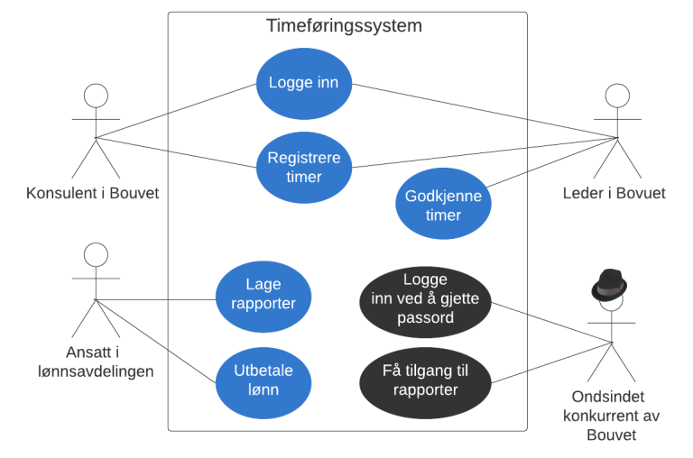

# Misbrukstilfeller og angrepshistorier

__Lær hvordan du kan spesifisere sikkerhetskrav som misbrukstilfeller og angrepshistorier.__

I vanlig utviklingsmetodikk er utviklere, arkitekter, produkteiere, testere og funksjonelt ansvarlige vant til å bruke brukstilfeller og/eller brukerhistorier som utgangspunkt for uviklingsprosessen. Med stor sannsynlighet er hele organisasjonen rigget og drillet til å fullføre en brukerhistorie fra start til mål. Dette innebærer som regel en funksjonell del hvor domeneeksperter, funksjonelle arkiteker, produkteiere og eksperter på brukeropplevelse finner ut av hva man skal lage. Deretter er det tekniske arkitekter og utviklere som ser på hva som må gjøres rent teknisk. Når funksjonaliteten er implementert vil testere og QA-ansvarlige se til at systemet fungerer som forventet. Hele denne prosessen er ofte godt innarbeidet og strømlinjeformet.

En brukerhistorie er vanligvis på formen:

    Som en <aktør>
    Ønsker jeg å <gjøre en handling>
    Slik at <et mål oppnås>

En angrepshistorie er på formen:

    Som en <trusselaktør>
    Må jeg IKKE ha muligheten til <å utføre uønsket handling>
    Slik at <uønsket hendelse inntreffer>

Ved å modellere trusler som angrepshistorier sørger man for å adressere trusler og mulige sårbarheter i systemet som en del av den eksisterende krav- og utviklingsprosessen.
Produkteier vil samtidig kunne prioritere angrepshistoriene opp mot andre brukerhistorier og vurdere kostnaden av et mulig angrep opp mot eventuell ny funksjonalitet. Utviklerne vil behandle disse angrepshistoriene som enhver vanlig brukerhistorie og "definition-of-done"-kriterier, som f.eks. enhetstester o.l, må være oppfylt for å kunne si at historien er levert.

## Eksempel

Her er et eksempel på misbrukstilfellediagram med en tilhørende angrepshistorie.

Angrepshistorie:

    Som en ondsindet konkurrent av Bouvet
    Må jeg IKKE ha muligheten til å logge inn ved å gjette på passord
    Slik at jeg får tilgang til sensitive data om timeføring i Bouvet

## Kilder

- Agile Application Security: Enabling Security in a Continuous Delivery Pipeline - Bell, L. and Brunton-Spall, M. and Smith, R. and Bird, J., O’Reilly Media Inc, 2017.
