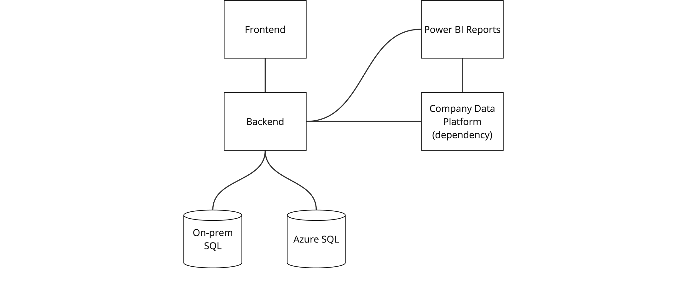
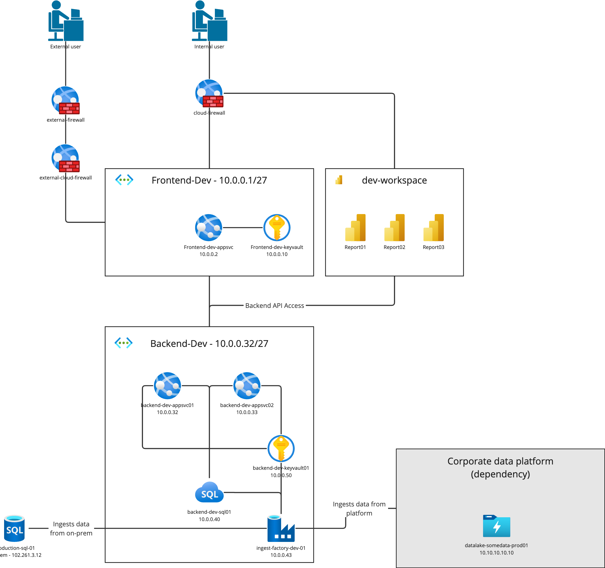
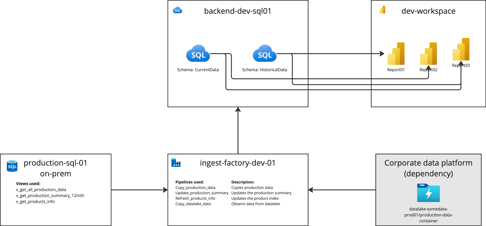
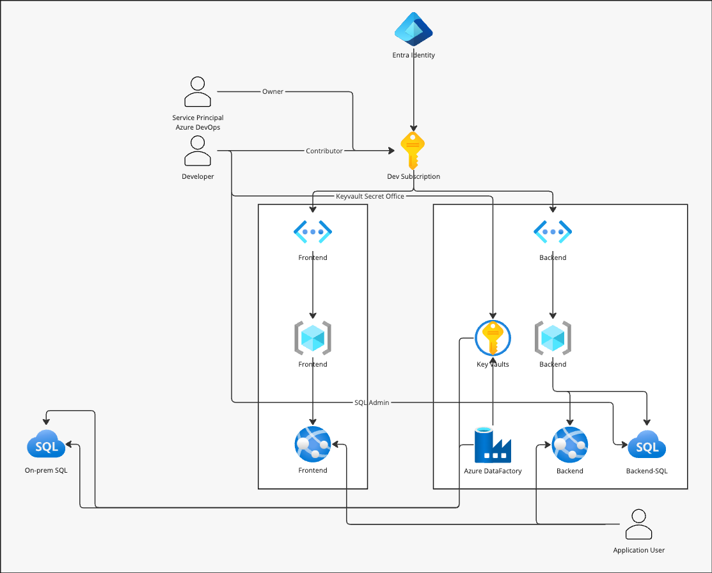

# Systemskisser
:::tip Kort oppsummert
Det er viktig med et godt underlag når vi skal bygge gode løsninger, og skisser og diagrammer som viser oppbygningen av infrastruktur, dataflyt, nettverk og tilgangsstyring er viktige elementer. Uten denne informasjonen er det vanskelig å validere om sluttresultatet matcher intensjonen.
:::

Når vi designer en løsning, er det viktig med gode og oversiktlige skisser og diagrammer som viser designet slik at det planlagt. Dette gjøres allerede av mange utviklerteam uten at det nødvendigvis stilles krav til det, men det er likevel greit å nevne her. 

Systemskissene bør gi nok informasjon til at en i etterkant kan 
* Validere at implementasjonen er som designet
* Bruke dem ifm trusselmodellering, pentesting eller liknende
* Brukes av den/de som forvalter løsningen for å få en god oversikt over komponenter og dataflyt
* Brukes av leveranseteamet for onboarding av nye kollegaer eller handover til andre team. 

Selv om det er mye som kan dokumenteres her, fokuserer vi bare på det viktigste her: 
* Overordnet systemskisse med de viktigste logiske komponentene
* Detaljert nettverksskisse med ressurser, tjenester og nettverk
* Dataflytdiagram - viser hvordan data flyter mellom komponenter i løsningen
* IAM-diagram - Viser identiteter, tilganger og roller samt hvor de hentes fra
* Viktige avhengigheter – oversikt over andre systemer, tjenester, ressurser, onprem/cloud

## Eksempler
Under finner du eksempler på punktene listet ovenfor. Diagrammene du produserer trenger ikke å være like, det viktigste er at de inneholder nok informasjon til at de kan brukes for det tiltenkte formålet og at de er forståelige for teamet. 

For enkelt å komme igang med design av diagrammer og skisser kan verktøy som Miro eller Draw.io brukes. Sistnevnte er gratis og tilbyr lagring av tegniner i nettleser, lokalt på maskinen som XML og mye annet. 

:::important Husk
Diagrammene trenger ikke å være perfekte, eller inneholde alle tenkelige detaljer. Vurder behovet og jobb med gradvise forbedringer over tid. 
:::

### Overordnet systemskisse

### Netverksdiagram

:::tip Husk
Nettverksdiagram bør lages for alle miljø, slik at en får nødvendig informasjon på alle ressurser i alle miljø, samt forbindelser mellom disse.  
:::
### Dataflytdiagram

### IAM-diagram

### Avhengigheter
* On-prem databaseserver _production-sql-01_
    * Bruker tre view vedlikeholdt av teamet
    * Data hentes inn via ADF
* Selskapets dataplattform, datalake datalake-somedata-prod01
    * Konsumerer datasett i containeren production-data-container
    * Lineage er synlig i Purview
    * Bruker kun datasett godkjent av dataeier

# Veien videre
* [Verktøy: Miro - Bruk SSO innlogging i Bouvet](https://miro.com/)
* [Verktøy: Draw.io](https://draw.io/)