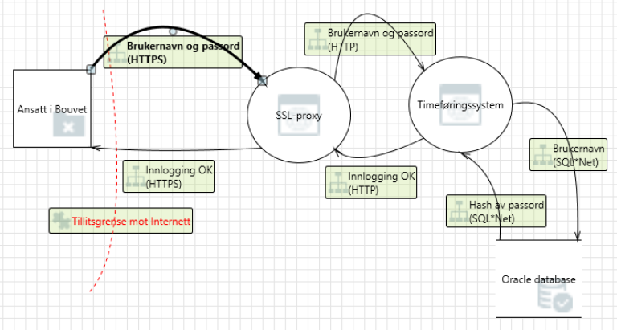

# Trusselmodellering
:::tip Kort oppsummert
Trusselmodellering er en øvelse der målet er å identifisere trusler i og rundt en løsning. Dette gjør at risikoene  kan identifiseres og vurderes opp mot et totalbilde av sikkerheten i løsningen. Fra en trusselmodell kan mitigerende tiltak identifiseres og implementeres for å redusere risiko.  
:::

__Dette er en kort introduksjon til trusselmodellering, dataflytdiagrammer, STRIDE og angrepstrær.__

Du har nok allerede gjort en enkel trusselmodellering uten at du selv er klar over det. Har du for eksempel tenkt på hvorfor brukerne av systemet du lager må logge seg inn med brukernavn og passord?

Når disse valgene ble tatt så har du automatisk gjort en enkel trusselmodellering. Du ønsker jo selvfølgelig ikke at uvedkommende skal kunne få tilgang til data i systemet ditt og du ønsker ikke at hvem som helst skal se data som overføres mellom brukerne dine og nettstedet ditt.

Hele poenget med trusselmodellering er å tenke som en angriper. 

## Identifisere trusler

Det finnes flere måter å identifisere trusler mot et system. Den enkleste metoden som ikke krever så mye, er å samle utviklingsteamet til en sosial kveld eller workshop, og prøve å tenke på hvordan man kan angripe systemet. Da vil man antagelig komme opp med mange potensielle trusler. Noen er sikkert allerede adressert, mens andre kanskje må testes ut og eventuelt graves dypere i. Når man har adressert alle trusselene og verifisert at mottiltak er implementert, så gjentar man prosessen. For å få et overblikk over prosessen er det ofte lur å tegne en oversikt (diagram) av systemet.

<figure>


<figcaption>Prosessen starter ofte med å tegne opp et diagram/oversikt av systemet, så identifisere trusler, adressere truslene, og til slutt validere at mottiltak er implementert, så gjenta.</figcaption>
</figure>

Dersom man ønsker å benytte mer formaliserte verktøy og prosesser så finnes det to mye brukte metoder for trusselmodellering, angrepstre og datafylytdiagrammer + STRIDE.

## Angrepstre

Bruk av angrepstrær er en fin måte å identifisere trusler på dersom man er god til å tenke som en angriper. Dersom dette ikke faller naturlig er bruk av dataflydiagrammer ofte en bedre metode.

Et angrepstre består av et hovedmål på toppen av treet, og med ulike måter å nå hovedmålet som noder.

<figure>


</figure>

I dette eksempelet er hovedmålet til en angriper å få tilgang til rapporter i et timeføringssystem. For å nå hovedmålet kan angriperen enten benytte et gyldig passord i systemet eller finne en svakhet i løsningen som gir tilgang. En måte å få tak i et gyldig passord er å bestikke en ansatt. Slik fyller man på med ulike måter for å nå hovedmålet og delmålene. Man går deretter gjennom de identifiserte truslene og verifisere at man har mottiltak på plass eller eventuelt velger å godta at det finnes trusler mot systemet som man ikke vil beskytte seg mot. Kostnaden på mottiltakene bør alltid veies opp mot verdiene som skal beskyttes.

Mer informasjon og flere eksempler på angrepstrær finnes i artikkelen [Attack Trees av Bruce Schneier](https://www.schneier.com/academic/archives/1999/12/attack_trees.html).

## Dataflytdiagram + STRIDE

Man starter med å lage et detaljert dataflytdiagram over systemet eller en del av systemet man skal trusselmodellering av.

Når man har tegnet opp dataflyten og tillitsgrensene til systemet, så bruker man STRIDE for å identifisere trusler. STRIDE er et akronym for
- **S**poofing - Kan man stole på at brukeren er man tror?
- **T**ampering - Kan noen endre på data med vilje eller uforvarende?
- **R**epudiation - Kan det bevises hvem som gjorde en gitt handling i systemet?
- **I**nformation disclosure - Kan data stjeles eller komme på avveie?
- **D**enial of Service - Kan noen gjøre at tjenester blir utilgjengelige?
- **E**levation of privilege - Kan noen tilegne seg utvidede rettighter i systemet?

<figure>



<figcaption>Her er et eksempel på et dataflytdiagram som viser dataflyten ved innlogging med brukernavn og passord. Pilene mellom tjenestene representerer kall. SSL-proxy er et sikkerhetslag som krypterer informasjon mellom tjenester. HTTPS er kall der informasjonen som sendes med er kryptert, og HTTP er kall der informasjonen som sendes med ikke er kryptert.</figcaption>
</figure>

I dataflytdiagrammet over kan man se at det er en fare for at noen med tilgang til nettverket mellom SSL-proxyen og timeføringssystemet kan lese og endre brukernavnet og passordet som ikke er kryptert over HTTP. Ved å gå gjennom alle dataflytene mens man tenker på mulige angrep i henhold til STRIDE-modellen kan man bygge opp en liste over mulige trusler mot systemet.

## Veien videre

Trusselmodellen må versjoneres og holdes oppdatert. Når en har identifisert trusler må mottiltak beskrives og effekten av disse vurderes. En vanlige tilnærming er å gi trusselen en verdi som indikerer alvorlighetsgrad, eksempelvis 1-10 der 10 er verst. Mottiltak vurderes tilsvarende, men med motsatt skala der 1 er liten effekt og 10 (eller opp til kritikalitet) er høyest effekt. Summen av disse gir en residuell risiko som sier noe om hva en sitter igjen med: 
```
Identifiserte trusler       Kritikalitet    Mottiltak   Gjenstående risk
Trussel 1                   8               8           0
Trussel 2                   2               0           2
Trussel 3                   4               3           1
Total                       14              11          3
```

Når en har identifisert en risiko, er det viktig at den som eier denne risikoen involveres, da det er denne som har ansvaret for å påse at prosjektet leverer kvalitet i tråd med forventninger og krav.
  
Det er viktig at mottiltak valideres for at dette skal ha noen hensikt. Trusselmodellen bør hentes opp med jevne mellomrom for å se hvordan situasjonen har endret seg, og dersom den totale kritikaliteten eller den residuelle risikoen overstiger en grense bør en vurdere tiltak for å redusere disse. 

# Veien videre
## Verktøy

- [Microsoft Threat Modeling Tool](https://docs.microsoft.com/en-us/azure/security/develop/threat-modeling-tool) gir deg en kick-start ved at en del vanlige trusler for diverse tjenester allerede er beskrevet. Dette verktøyet er særlig nyttig dersom man opererer i Microsoft Azure.
- [OWASP Threat Dragon](https://www.owasp.org/index.php/OWASP_Threat_Dragon) er et tilsvarende open source verktøy, som det kan være verdt å ta en titt på.
- [Draw.io](https://draw.io) med denne pakken [drawio-threatmodeling](https://github.com/michenriksen/drawio-threatmodeling) er et verktøy som både på web og i de vanligste klientene

## Kurs og foredrag

- [Threat Modeling Fundamentals (pluralsight)](https://app.pluralsight.com/library/courses/threat-modeling-fundamentals/)
- [Trusselmodellering - hva er det? (BouvetOne 2020)](https://web.microsoftstream.com/video/fda76058-2cf6-4eda-91e2-56aea56d0628)
- [An Introduction to threat modeling (Javazone 2018)](https://vimeo.com/234010802)
- [Threat Modeling in 2019 (RSA Conference 2019)](https://www.youtube.com/watch?v=ZoxHIpzaZ6U)

## Andre kilder

- [Trusselmodellering](https://infosec.sintef.no/informasjonssikkerhet/2018/06/trusselmodellering/) - Martin Gilje Jaatun, Seniorforsker, Dr. Philos, SINTEF
- [OWASP Application Threat Modeling](https://www.owasp.org/index.php/Application_Threat_Modeling)
