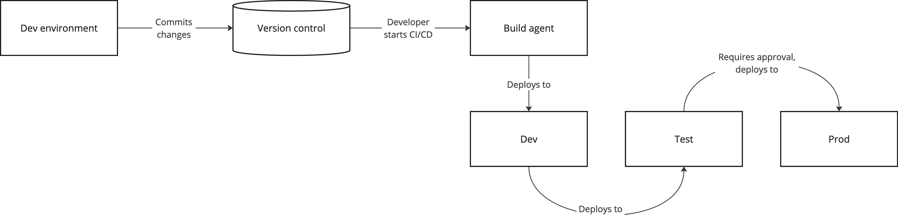

# CI/CD
:::tip Kort oppsummert
Når vi lager løsninger må disse bygges og deployes på en konsistent måte. Bruk av CI/CD fjerner menneskelige feil fra prosessen, og sikrer at vi kan reprodusere både artifakter og deployments på en god måte.  
:::

Når vi setter opp kjøremiljøer er det viktig å også tenke på hvordan løsningen vi utvikler kan bygges og deployes til disse på en måte som både gjør det enkelt og fjerner behovet for at en person skal måtte bruke tid og energi på å gjøre det samme hver gang. 

## Bruk av CI/CD
Continuous Integration og Continuous Delivery, ofte forkortet CI/CD er vanlige tilnærminger for hvordan software bygges og deployes til kjøremiljø, ofte ved hjelp av skript i form av pipelines eller actions. Navn og begreper her avhenger av hvilke verktøy en bruker, men prinsippet er mye det samme. 

En slik pipeline kan gjøre mye mer enn bare å bygge, den kan også utføre andre oppgaver som å kjøre automatisert testing, sårbarhetsskanning, skanning av hemmeligheter og mye annet. Uavhengig av hva en bruker den til, er det viktig å være klar over risikoelementene assosiert med CI/CD. 

Den store fordelen med CI/CD er automatikken bygd inn i løsningen. Hver gang du kjører igang en pipeline arkiveres kjøringen og alle artifakter og kobles mot versjonskontrollsystemet slik at du kan gå tilbake og se hvilken comitt som ble brukt. Kjøring av CI/CD bør i utgangspunktet være ufarlig gitt at en har kontroll på, og beskytter branchen som brukes som basis for deployment til produksjonsmiljøet. 

## Bygging 
Bygging er ofte det første steget i prosessen, og gjøres typisk bare en gang per release. Byggmiljøene brukt i en CI/CD prosess, ofte kalt byggagenter kommer ofte i to former: 
* skyleverandørstyrte agenter
* selvstyrte agenter - disse kan hostes både i sky eller on-premise

Med agenter styrt av skyleverandøren brukes standardimages ferdig konfigurert for denne oppgaven. De deployes når du starter en byggeprosess, og inneholder alt av verktøy som trengs for byggingen. Når de er ferdig deployet sjekker de ut kildekoden din, bygger den, lagrer artifakten i et egnet system før instansen stanses og slettes. 

Selvstyrte agenter er mer komplekse da du har ansvar for alt av vedlikehold og konfigurasjon selv. Til gjengjeld har du da dedikerte agenter som kun brukes av teamene eller prosjektene som gis tilgang til disse. 

Selv om det første alternativet somoftest er godt nok, er det viktig å være klar over mulighetene som finnes, og når en bør vurdere disse. Uansett løsning er det viktig å tenke på at byggmiljøet er et veldig sårbart punkt; dersom dette kompromitteres kan en angriper potensielt utføre endringer som påvirker _alt_ som bygges der. 

Dette er spesielt viktig med bruk av [tredjepartspakker](../03_utvikle/05_software_supply_chain.md), og et minimum her bør være at pakker pinnes til spesifikke versjoner og at en aldri henter siste versjon av en pakke automatisk. 

## Deployering
Når en deployerer en applikasjon tar man utgangspunkt i artifakten som ble bygget, som så lastes opp til ønsket kjøremiljø. For å sikre konsistens er det vanlig å bare bygge en gang, slik at man deployer det samme artifaktet flere steder - dersom miljøene er like og artifaktet er det samme, skal vi se det samme overalt. 

Det er vanlig å ha flere steg i pipelinen som håndterer deployment til ulike miljø, slik at en kun deployer til neste miljø dersom steget før var vellykket. Ved behov kan en også restarte et steg i pipelinen dersom det oppstår uventede feil for å utelukke at det var selve deploymenten som resulterte i dette. 

I en deployment pipeline er det viktig å ha et forhold til når det er greit å deploye. Å kjøre en deployment skal ikke være farlig, da hele prosessen er automatisert. Men i mange tilfeller vil en unngå å rulle ut endringer eller ny funksjonalitet i enkelte miljø før dette er klarert med produkteier. For å unngå at noen ved et uhell deployer til feil miljø bør en ha noen godkjenningstrinn underveis, der en eksempelvis setter som krav at andre i teamet skal godkjenne en deployment før den får starte. 

# Veien videre
* [Microsoft: Azure Pipelines](https://learn.microsoft.com/en-us/azure/devops/pipelines/get-started/pipelines-get-started?view=azure-devops)
* [Github: Github Actions](https://docs.github.com/en/actions)
* [OWASP Top 10 CI/CD Security Risks](https://owasp.org/www-project-top-10-ci-cd-security-risks/)