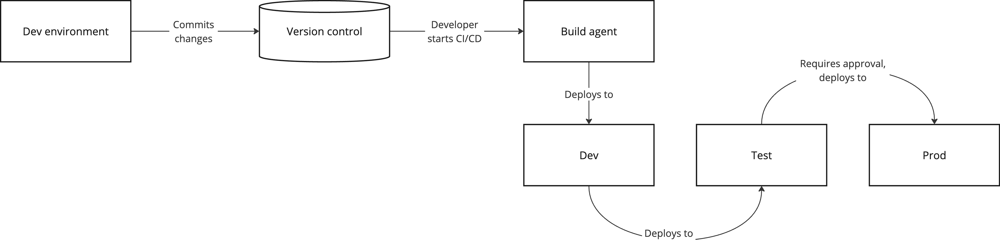

# CI/CD
:::tip Kort oppsummert
Når vi lager løsninger må disse bygges og deployes på en konsistent måte. Bruk av CI/CD fjerner menneskelige feil fra prosessen, og sikrer at vi kan reprodusere både artifakter og deployments på en god måte.  
:::

Når vi setter opp kjøremiljøer er det viktig å også tenke på hvordan løsningen vi utvikler kan bygges og deployes til disse på en måte som både gjør det enkelt og fjerner behovet for at en person skal måtte bruke tid og energi på å gjøre det samme hver gang. 

## Bruk av CI/CD
Continuous Integration og Continuous Delivery, ofte forkortet CI/CD er vanlige tilnærminger for hvordan software bygges og deployes til kjøremiljø, ofte ved hjelp av skript i form av pipelines eller actions. Navn og begreper her avhenger av hvilke verktøy en bruker, men prinsippet er mye det samme. 

En slik pipeline kan gjøre mye mer enn bare å bygge, den kan også utføre andre oppgaver som å kjøre automatisert testing, sårbarhetsskanning, skanning av hemmeligheter og mye annet. Uavhengig av hva en bruker den til, er det viktig å være klar over risikoelementene assosiert med CI/CD. 

Den store fordelen med CI/CD er automatikken bygd inn i løsningen. Hver gang du kjører igang en pipeline arkiveres kjøringen og alle artifakter og kobles mot versjonskontrollsystemet slik at du kan gå tilbake og se hvilken comitt som ble brukt. Kjøring av CI/CD bør i utgangspunktet være ufarlig gitt at en har kontroll på, og beskytter branchen som brukes som basis for deployment til produksjonsmiljøet. 

# Veien videre
* [Microsoft: Azure Pipelines](https://learn.microsoft.com/en-us/azure/devops/pipelines/get-started/pipelines-get-started?view=azure-devops)
* [Github: Github Actions](https://docs.github.com/en/actions)
* [OWASP: Top 10 CI/CD Security Risks](https://owasp.org/www-project-top-10-ci-cd-security-risks/)
* [OWASP: CI/CD Security Cheat Sheet](https://cheatsheetseries.owasp.org/cheatsheets/CI_CD_Security_Cheat_Sheet.html)