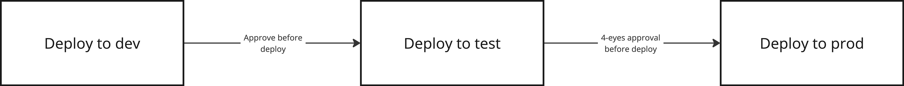

# Deployering
:::tip Kort oppsummert
Når vi deployer en løsning flytter vi den fra et artifaktlager og ut i kjøremiljøene. Hvordan dette skjer avhenger av platformen som brukes. 
:::

Når vi setter opp kjøremiljøer er det viktig å også tenke på hvordan løsningen vi utvikler kan bygges og deployes til disse på en måte som både gjør det enkelt og fjerner behovet for at en person skal måtte bruke tid og energi på å gjøre det samme hver gang. 

Når en deployerer en applikasjon tar man utgangspunkt i artifakten som ble bygget, som så lastes opp til ønsket kjøremiljø. For å sikre konsistens er det vanlig å bare bygge en gang, slik at man deployer det samme artifaktet flere steder - dersom miljøene er like og artifaktet er det samme, skal vi se det samme overalt. 

Det er vanlig å ha flere steg i pipelinen som håndterer deployment til ulike miljø, slik at en kun deployer til neste miljø dersom steget før var vellykket. Ved behov kan en også restarte et steg i pipelinen dersom det oppstår uventede feil for å utelukke at det var selve deploymenten som resulterte i dette. 

I en deployment pipeline er det viktig å ha et forhold til når det er greit å deploye. Å kjøre en deployment skal ikke være farlig, da hele prosessen er automatisert. Men i mange tilfeller vil en unngå å rulle ut endringer eller ny funksjonalitet i enkelte miljø før dette er klarert med produkteier. For å unngå at noen ved et uhell deployer til feil miljø bør en ha noen godkjenningstrinn underveis, der en eksempelvis setter som krav at andre i teamet skal godkjenne en deployment før den får starte. 

# Veien videre
* [Microsoft: Azure Pipelines](https://learn.microsoft.com/en-us/azure/devops/pipelines/get-started/pipelines-get-started?view=azure-devops)
* [Github: Github Actions](https://docs.github.com/en/actions)
* [OWASP: Top 10 CI/CD Security Risks](https://owasp.org/www-project-top-10-ci-cd-security-risks/)
* [OWASP: CI/CD Security Cheat Sheet](https://cheatsheetseries.owasp.org/cheatsheets/CI_CD_Security_Cheat_Sheet.html)