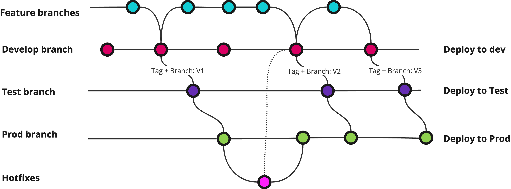

# Tools Used in Delivery
:::tip In Short
Misconfiguration is a common source of errors and vulnerabilities, and this also applies to tools. If possible, the team should standardize the use of tools and their extensions, ensuring that everyone follows a similar (and documented) workflow.
:::

All development teams use various tools in the development process, and the selection will vary from team to team depending on personal preferences, technology choices, system and customer requirements, and much more.

A typical team will use some form of
* [IDE](https://en.wikipedia.org/wiki/Integrated_development_environment)
* a version control system for the code, typically _git_
* a tool for [CI/CD](https://en.wikipedia.org/wiki/CI/CD) that can perform various tasks related to building, testing, or deployment
* other services managed or consumed by the team, e.g., messaging services, file transfer services, or similar

These tools can significantly impact security and quality in deliveries, so it is important that the team considers how these are configured.

## IDE
Most IDEs today allow the installation of extensions that provide support for new languages, formatting, linting, cloud services, and much more. These can significantly improve the productivity and efficiency of the team, but we must be cautious about what is installed.

As with everything else downloaded and run from the internet, we must consider the risk when using extensions. It is important that we are aware of what we download, where it is downloaded from, and who is behind it to avoid problems. 

## Version Control
Version control provides excellent control over all changes, but it is important that we use the tool properly.

Remember that source code is part of the project and must be considered in relation to [disaster recovery and backups](03_business_continuity)!

### Security in the Source Code System
Many rely on solutions like Azure DevOps, GitHub, or similar that handle access control, reviews, and other functions related to confidentiality and integrity of the source code.

However, Git also has built-in functionality for signing commits, so that each commit can be traced to a person with a given key. This can be a useful tool for ensuring integrity and should be considered by the team.

### Branching Strategy
A typical approach is to operate with a production branch, often `main` or `master`. This should be protected so that all changes occur in separate feature branches that are then merged via pull request with corresponding review from others in the team. The production branch then serves as the basis for all further deployments.

There are other more complex approaches as well, such as separate branches and version tagging. This is especially useful if maintaining multiple versions in different environments, needing the ability for hotfixes, or similar:

In this example, all developers work in their own feature branches against the develop branch, which is protected from direct changes. This is deployed to the dev environment to verify that everything works as it should.

When the team is satisfied with the state of develop, it is merged to test via a dedicated pipeline that handles version number tagging automatically. This pipeline may require approval to run, needing one person to start it and another to approve.

The test branch is deployed to the test environment, and when the customer is satisfied with what has been delivered, it is merged to the prod branch in the same way as to test. For both test and prod, we use the version number as part of the branch name, so we can have branches Test/v1 and Test/v2, corresponding with Prod/v1 and Prod/v2.

If hotfixing against prod is needed, this can be done against the relevant prod branch to quickly correct critical errors, and then the hotfix can be taken back to dev.

:::tip pre-commit
A tip is to use [pre-commit](https://pre-commit.com) to run all linting, formatting, and testing, and then use the same _pre-commit_ configuration in CI/CD. This will minimize maintenance, make it easy to test locally, and catch problems early.
:::

## CI/CD
A good [CI/CD system (Continuous Integration / Continuous Deployment)](/en/deploy/cicd) can be used to significantly increase the security of the final product by automating various checks and tests that ensure the quality of the delivery.

Be aware that several of the points below require additional software. We currently do not have shared licenses for developers at Bouvet; this must be managed by each project depending on needs and requirements. If the team handles this on its own, be aware of license conditions and how tools work. Some tools, for example, send source code to their own servers for analysis, which is generally not allowed unless agreed upon with the customer.

### Software Composition Analysis (SCA)
[Software composition analysis (SCA)](/develop/software_supply_chain) can be set up automatically as part of CI/CD. We have many dependencies on components made by others, so it is important to keep track of existing and newly discovered vulnerabilities in what we create.

### Testing
Running tests in CI is beneficial for several reasons, but from a security perspective, there are specific tests that should be included.

* Test all relevant endpoints for 401/403 responses
* Test code that handles authorization (who gets to do what). It is advantageous if all authorization logic happens in a centralized place in the codebase.
* Test for strict [JWT validation](https://owasp.org/www-project-web-security-testing-guide/latest/4-Web_Application_Security_Testing/06-Session_Management_Testing/10-Testing_JSON_Web_Tokens)

### Static Application Security Testing (SAST)
[Static application security testing (SAST)](/en/develop/sikkerhetstesting) should be configured to run automatically as part of CI/CD. Consider whether a build should fail if the static code analysis detects serious weaknesses in the code or low test coverage.

### Secret Scanning
[Secret scanning](/en/develop/secrets) - passwords, keys, and other sensitive information that should not be in the source code is an important tool that can be implemented in the version control system and in CI/CD. Some tools only provide alerts when secrets are found, while others can also invalidate the secrets in the services they are meant for.

# More Information
* [Atlassian: Branching strategy: a path to greatness](https://www.atlassian.com/agile/software-development/branching)
* [Github: About secret scanning](https://docs.github.com/en/code-security/secret-scanning/about-secret-scanning)
