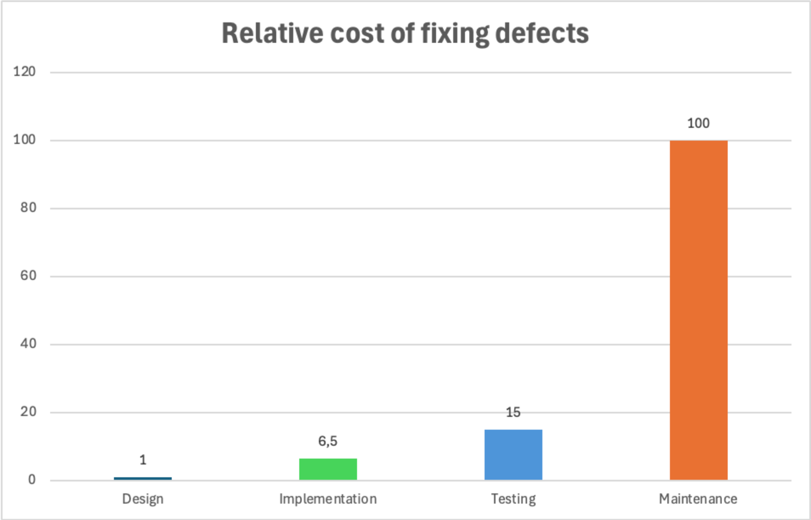

# Security Checkpoints
:::tip In Short
A security checkpoint is a control point during a project where requirements must be met before proceeding.
:::

Depending on the security level a delivery aims to achieve, it may be necessary to define mechanisms for assessing security at fixed points in the development cycle, known as security checkpoints.

These can be defined between logical phases in the project, for example, between the design and development phases, or when transitioning from development to the first release in production. Other and additional checkpoints can also be defined, entirely depending on the requirements the delivery team must adhere to.

[In a study by IBM](https://www.researchgate.net/figure/IBM-System-Science-Institute-Relative-Cost-of-Fixing-Defects_fig1_255965523) it was determined that defects in applications developed for the U.S. military cost significantly less to fix early in the process compared to later.  

By implementing security checkpoints, it becomes easier to catch weaknesses early and to ensure compliance with security and quality requirements. A typical practice using checkpoints could include
* creating a [design](/en/design/system_diagrams) of the project before the development cycle starts
* the implementation should always follow the design
* verification that the design and implementation actually match before going into production

# More Information
* [Dawson, Maurice, et al. "Integrating software assurance into the software development life cycle (SDLC)." Journal of Information Systems Technology and Planning 3.6 (2010): 49-53.](https://d1wqtxts1xzle7.cloudfront.net/43105461/fulltext_stamped-libre.pdf?1456510133=&response-content-disposition=inline%3B+filename%3DIntegrating_Software_Assurance_into_the.pdf&Expires=1719440984&Signature=eH8UCTexOuHmFfCL~FAtaw4tuESm5nRoKrrlOAt~UqP2Od6V7lis-gvCNcmZtLIJYpAQ1LaznsUPbUDIk39imYfEqHeqk9JpODsYN5T4aF32VM6-RhkhIBYRDHL
