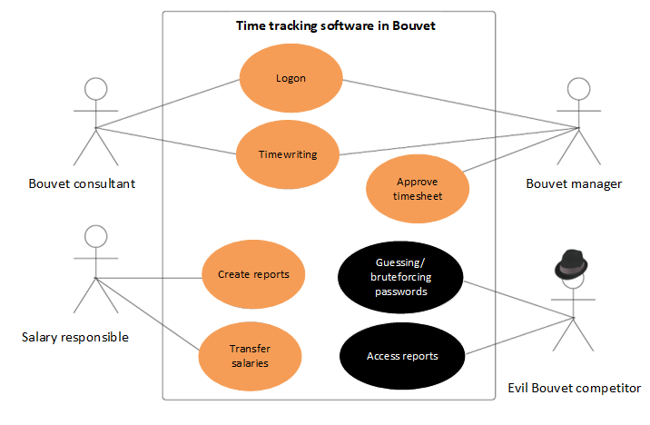

# Misuse cases

__Learn how to specify security requirements such as misuse cases.__

In the traditional development lifecycle developers, architects, product owners and testers are used to having _use cases_ which define the desired functionality. This is typically heavily engrained in the organization, and is often used as a basis when something is to be implemented or changed. It is often short and to the point; UX-people, architects domain experts and others will the expand on this and define what needs to be done in order to achieve the goal. 

A typical use case can often be on the form:

```
As a <user>
I want to <do something>
in order to achieve <something>
```

An misuse case on the hand is typically on the form:

```
As an <attacker>
I CANNOT be able to <do something>
Resulting in <an undesirable consequence>
```

By modelling threats as attack stories, threats and potential vulnerabilities can be addressed as part of the regular development process. The product owner is able to prioritize the attack stories along with the regular functional requirements, and can assess the potential cost of a successful attack against the cost of new functionality. The developers will treat the attack stories as any other use case, and the criteria for "definition-of-done" has to be fulfilled in order to close the story as completed. 

## Example



Misuse case:

    As an evil competitor of Bouvet, 
    I shall NOT be able to log in by brute-forcing passwords,
    allowing me access to sensitive information on time-writing in Bouvet.

## References

- Agile Application Security: Enabling Security in a Continuous Delivery Pipeline - Bell, L. and Brunton-Spall, M. and Smith, R. and Bird, J., O’Reilly Media Inc, 2017.
