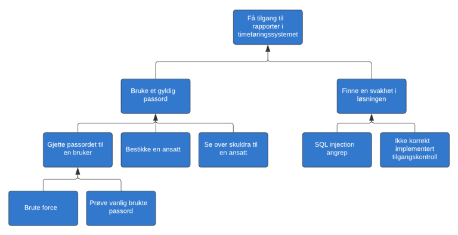
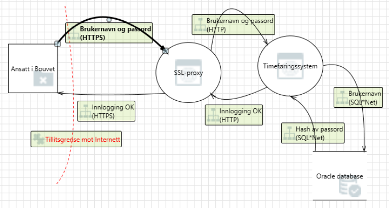

# Threat modelling

__This is a short introduction to threat modelling, data flow diagrams, STRIDE and attack trees.__

You've probably done some threat modelling already without even knowing that you did. Did you ever consider why users of the system you're working on has to authenticate using a username and password? 

While making those choices, you already did a basic level of threat modelling. The last thing you want is to allow unauthorized people to access any data in your system, or capture the data sent between your users and your site. 

The whole point about doing threat modelling is to assess the system as an attacker!

## Identifying threats

There are several ways you can identify threats against a system. The simplest method is to simply gather the development team for a social evening or a workshop, trying to come up with ways to attack the system. This by itself will probably result in a list of potential threats. 
Some of these will probably be mitigated by the existing code and design, while others has to be explored and tested. Once the threats have been addressed by changes to the design, code or configuration, the process can be repeated. 
In order to get an overview of the processed and the identified threats, a diagram should be created. 

<figure>

<figcaption>
The process typically starts by creating a diagram of the system, before threats are identified, mitigated before the countermeasures are validated. Rince and repeat.
</figcaption>
</figure>

If more formalized and structured tools are required, attack trees and data flow diagrams + STRIDE are two common tools used to handle the threat modelling process.

## Attack trees

Considering the system as seen by an attacker can be a good technique to help you build attack trees. An attack tree typically consists of a main goal as the topmost node of the tree, with different ways to accomplish this as leafs below. 
These can then be further broken down into new leafs, until you have a complete sequence allowing you to attack. 

<figure>

</figure>

In this example the main goal of the attacker is to get access to reports in a time tracking system. To accomplish this, they can either use a valid password, or find a vulnerability in the system that gives them the same access. 
One way to get a valid password can be to bribe an employee. Another method can be to try common passwords. 

By working through the various scenarios you identify the risk-related elements, and can then act on these. Some can be removed or at least reduced by allowing the team to come up with mitigating measures, while others will remain after considering the cost vs benefit of the mitigating actions. 
Some risks are costly to defend against, and in such cases you should always consider the cost of the measure versus the cost of what is to be defended. 

More information and further examples of attack trees can be found in the article [Attack Trees by Bruce Schneier](https://www.schneier.com/academic/archives/1999/12/attack_trees.html).

## Data flow diagram + STRIDE

The use of attack trees can be a good way to identify threats if you are able to think as an attacker. If not, the use of data flow diagrams can often be a better alternative.
Start by creating a detailed data flow diagram of the system to threat model. 

Once the diagram is complete, and the trust boundaries have been added, STRIDE can be used to identify threats. STRIDE is 
- **S**poofing - can you trust that the user is who we think?
- **T**ampering - Can someone alter data by mistake or on purpose? 
- **R**epudiation - Can you prove who made a any given change to the system? 
- **I**nformation disclosure - Is it possible to steal or otherwise leak data?
- **D**enial of Service - Can someone impact the availability of the system?
- **E**levation of privilege - Is it possible to obtain permissions you aren't supposed to have? 

<figure>

<figcaption>
	This is an example of a data flow diagram showing the data flow when logging in using a username and password. The arrows between the various services represents requests. SSL-proxy is a security layer responsible to encrypting the information during transit between services. HTTPS are requests wher the information submitted is encrypted, and HTTP represents unencrypted requests.
</figcaption>
</figure>

In the data flow diagram above the danger of someone with access to the network between the SSL-proxy and the time tracking software can read and modify the username and password sent unencrypted over HTTP. By analyzing all the various data flows while considering possible attacks according to the STRIDE-model, a list of potential threats against the system can be compiled. 

Once the threats have been identified, countermeasures must be defined and validated to ensure that they actually prevent the threat from succeeding. 

## Tools

- [Microsoft Threat Modeling Tool](https://docs.microsoft.com/en-us/azure/security/develop/threat-modeling-tool) gives you a head start by already listing a set of common threats for various services. This tool is particularly useful if you operate within the Microsoft Azure Cloud platform. 
- [OWASP Threat Dragon](https://www.owasp.org/index.php/OWASP_Threat_Dragon) is a similar tool as the Microsoft variant above.
- [Draw.io](https://draw.io) using the [drawio-threatmodeling](https://github.com/michenriksen/drawio-threatmodeling) library is a useful tool for most platforms. 

## Classes and lectures

- [Threat Modeling Fundamentals (pluralsight)](https://app.pluralsight.com/library/courses/threat-modeling-fundamentals/)
- [Trusselmodellering - hva er det? (BouvetOne 2020)](https://web.microsoftstream.com/video/fda76058-2cf6-4eda-91e2-56aea56d0628)
- [An Introduction to threat modeling (Javazone 2018)](https://vimeo.com/234010802)
- [Threat Modeling in 2019 (RSA Conference 2019)](https://www.youtube.com/watch?v=ZoxHIpzaZ6U)

## Sources

- [Threat modelling (NO)](https://infosec.sintef.no/informasjonssikkerhet/2018/06/trusselmodellering/) - Martin Gilje Jaatun, Senior researcher, Dr. Philos, SINTEF
- [OWASP Application Threat Modeling](https://www.owasp.org/index.php/Application_Threat_Modeling)
