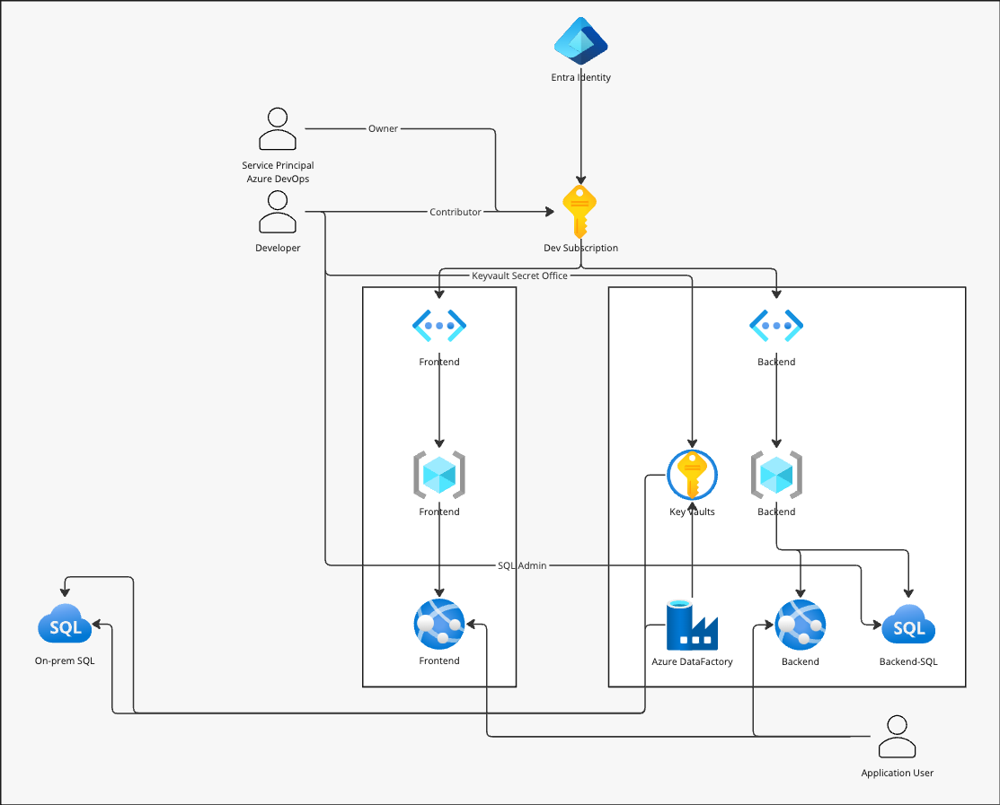

# System diagrams and drawings
:::tip In Short
It's important to have a good foundation when building quality solutions, and drawings and diagrams showing the infrastructure, data flow, networks, and access control are crucial elements. Without this information, it is difficult to validate if the implementation matches the intended design.
:::

When designing a solution, it's essential to have clear and comprehensive drawings and diagrams that show the planned design. This is already done by many development teams without necessarily being a formal requirement, but it's still worth mentioning here.

System diagrams should provide enough information to:
* Validate that the implementation matches the design
* Use them for threat modeling, pentesting, or similar activities
* Be used by those managing the solution to get a good overview of components and data flow
* Be used by the delivery team for onboarding new colleagues or handover to other teams

Although there is a lot that can be documented here, we focus on the most important aspects:
* High-level system sketch with the main logical components
* Detailed network diagram with resources, services, and networks
* Data flow diagram showing how data flows between components in the solution
* IAM diagram showing identities, accesses, and roles and where they are sourced from
* Important dependencies – overview of other systems, services, resources, on-prem/cloud

## Examples
Below are examples of the points listed above. The diagrams you produce do not need to be identical; the most important thing is that they contain enough information to be used for their intended purpose and are understandable to the team.

To easily get started with designing diagrams and sketches, tools like Miro or Draw.io can be used. The latter is free and offers storage of drawings in the browser, locally on the machine as XML, and much more.

:::important Remember
The diagrams do not need to be perfect or contain every conceivable detail. Assess the need and work on gradual improvements over time.
:::

### High-level System Diagram
This diagram should be a high-level introduction to the solution, showing all the major components and interactions between them. 

### Network Diagram
The goal of the network diagram is to show the network topology, with all the various virtual networks, subnets and resources or servers and firewall openings between them. 

:::tip Remember
Network diagrams should be created for all environments, providing necessary information on all resources in all environments, as well as connections between them.
:::
### Data Flow Diagram
The data flow diagram shows the data flow of the solution. This should include all direct dependencies not part of the project, so that it is possible to understand where data originates and all the nodes it interacts with. 

### IAM Diagram

### Dependencies
This can also be drawn, but often a simple list is enough. This should contain all direct dependencies of the solution being developed, with a brief summary containing descriptions of what the team depend on. 

* On-prem database server _production-sql-01_
    * Uses three views maintained by the team
    * Data is imported via ADF
* Company's data platform, datalake _datalake-somedata-prod01_
    * Consumes datasets in the container _production-data-container_
    * Lineage is visible in Purview
    * Uses only datasets approved by the data owner

# More Information
* [Tool: Miro - Use SSO login at Bouvet](https://miro.com/)
* [Tool: Draw.io](https://draw.io/)
