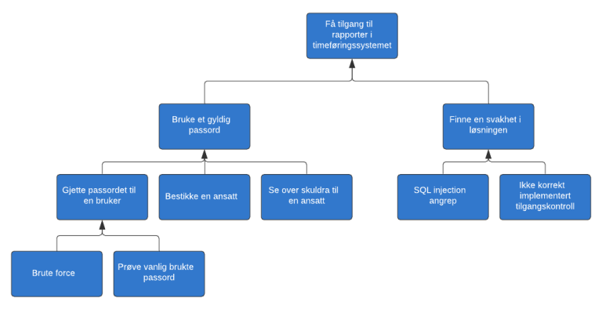

# Threat Modeling
:::tip In Short
Threat modeling is an exercise aimed at identifying threats so that the risk of these can be identified and assessed against the overall security of the solution. From a threat model, mitigating measures can be identified and implemented to reduce risk.
:::

__This is a brief introduction to threat modeling, data flow diagrams, STRIDE, and attack trees.__

You may have already done simple threat modeling without realizing it. For example, have you ever thought about why the users of the system you're creating need to log in with a username and password?

When these choices were made, you automatically performed simple threat modeling. You certainly don't want unauthorized individuals to access data in your system, and you don't want anyone to see the data transferred between your users and your website.

The whole point of threat modeling is to think like an attacker.

## Identifying Threats

There are several ways to identify threats to a system. The simplest method, which doesn't require much, is to gather the development team for a social evening or workshop and try to think about how to attack the system. This will likely result in many potential threats. Some are probably already addressed, while others may need to be tested and possibly investigated further. Once all threats have been addressed and it has been verified that countermeasures are implemented, the process is repeated. To get an overview of the process, it is often wise to draw a diagram of the system.

<figure>


<figcaption>The process often starts with drawing a diagram/overview of the system, identifying threats, addressing the threats, and finally validating that countermeasures are implemented, then repeating the process.</figcaption>
</figure>

If you want to use more formalized tools and processes, there are two widely used methods for threat modeling: attack trees and data flow diagrams + STRIDE.

## Attack Trees

Using attack trees is a good way to identify threats if you are good at thinking like an attacker. If this doesn't come naturally, using data flow diagrams is often a better method.

An attack tree consists of a main goal at the top of the tree, with various ways to achieve the main goal as nodes.

<figure>



</figure>

In this example, the main goal of an attacker is to access reports in a time tracking system. To achieve the main goal, the attacker can either use a valid password in the system or find a vulnerability in the solution that grants access. One way to obtain a valid password is to bribe an employee. This way, you add different ways to reach the main goal and subgoals. You then go through the identified threats and verify that countermeasures are in place or decide to accept that there are threats to the system that you will not protect against. The cost of countermeasures should always be weighed against the value of what is being protected.

More information and examples of attack trees can be found in the article [Attack Trees by Bruce Schneier](https://www.schneier.com/academic/archives/1999/12/attack_trees.html).

## Data Flow Diagram + STRIDE

Start by creating a detailed data flow diagram of the system or part of the system you are threat modeling.

Once the data flow and trust boundaries of the system have been drawn, use STRIDE to identify threats. STRIDE is an acronym for:
- **S**poofing - Can you trust that the user is who they claim to be?
- **T**ampering - Can someone modify data intentionally or unintentionally?
- **R**epudiation - Can it be proven who performed a given action in the system?
- **I**nformation disclosure - Can data be stolen or leaked?
- **D**enial of Service - Can someone make services unavailable?
- **E**levation of privilege - Can someone gain elevated rights in the system?

<figure>


<figcaption>Here is an example of a data flow diagram showing the data flow during login with username and password. The arrows between services represent calls. The SSL proxy is a security layer that encrypts information between services. HTTPS are calls where the information sent is encrypted, and HTTP are calls where the information sent is not encrypted.</figcaption>
</figure>

In the data flow diagram above, you can see that there is a risk that someone with access to the network between the SSL proxy and the time tracking system can read and modify the username and password that are not encrypted over HTTP. By going through all data flows while thinking about possible attacks according to the STRIDE model, you can build a list of potential threats to the system.

## Moving Forward

The threat model must be versioned and kept up to date. Once threats have been identified, countermeasures must be described, and their effectiveness assessed. A common approach is to give the threat a value indicating severity, for example, 1-10 where 10 is the worst. Countermeasures are assessed similarly but with the opposite scale where 1 has little effect and 10 (or up to criticality) has the highest effect. The sum of these gives a residual risk that indicates the remaining risk:

```
Identified Threats          Criticality     Countermeasures Residual Risk
Threat  1                   8               8               0
Threat  2                   2               0               2
Threat  3                   4               3               1
Total                       14              11              3
```


When a risk is identified, it is important that the risk owner is involved, as they are responsible for ensuring that the project delivers quality in line with expectations and requirements.

It is important that countermeasures are validated for them to be effective. The threat model should be reviewed regularly to see how the situation has changed, and if the total criticality or residual risk exceeds a threshold, consider measures to reduce them.

# More Information
## Tools

- [Microsoft Threat Modeling Tool](https://docs.microsoft.com/en-us/azure/security/develop/threat-modeling-tool) gives you a kick-start by describing common threats for various services. This tool is especially useful if you operate in Microsoft Azure.
- [OWASP Threat Dragon](https://www.owasp.org/index.php/OWASP_Threat_Dragon) is a similar open-source tool worth checking out.
- [Draw.io](https://draw.io) with this package [drawio-threatmodeling](https://github.com/michenriksen/drawio-threatmodeling) is a tool available both on the web and in common clients.

## Courses and Lectures

- [Threat Modeling Fundamentals (pluralsight)](https://app.pluralsight.com/library/courses/threat-modeling-fundamentals/)
- [Trusselmodellering - hva er det? (BouvetOne 2020)](https://web.microsoftstream.com/video/fda76058-2cf6-4eda-91e2-56aea56d0628)
- [An Introduction to threat modeling (Javazone 2018)](https://vimeo.com/234010802)
- [Threat Modeling in 2019 (RSA Conference 2019)](https://www.youtube.com/watch?v=ZoxHIpzaZ6U)

## Other Sources

- [Trusselmodellering](https://infosec.sintef.no/informasjonssikkerhet/2018/06/trusselmodellering/) - Martin Gilje Jaatun, Senior Researcher, Dr. Philos, SINTEF
- [OWASP Application Threat Modeling](https://www.owasp.org/index.php/Application_Threat_Modeling)
