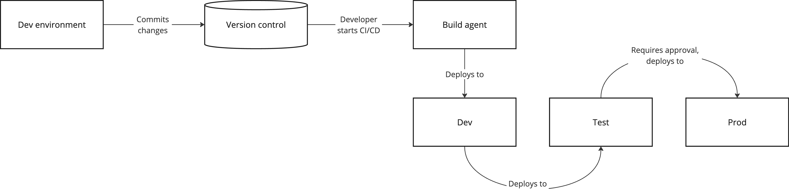
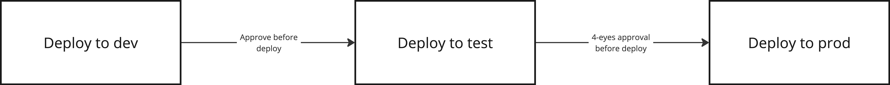

# Deployment
:::tip In Short
When we deploy a solution, we move it from an artifact repository into the runtime environments. How this happens depends on the platform used.
:::

When setting up runtime environments, it is important to consider how the solution we are developing can be built and deployed to these in a way that makes it easy and removes the need for a person to spend time and energy doing the same thing each time.

When deploying an application, you start with the artifact that was built, which is then uploaded to the desired runtime environment. To ensure consistency, it is common to build only once so that the same artifact is deployed to multiple locations - if the environments are the same and the artifact is the same, we should see the same result everywhere.

It is common to have several steps in the pipeline that handle deployment to different environments, so that you only deploy to the next environment if the previous step was successful. If necessary, you can also restart a step in the pipeline if unexpected errors occur to rule out that it was the deployment itself that caused this.

In a deployment pipeline, it is important to consider when it is appropriate to deploy. Running a deployment should not be dangerous, as the entire process is automated. However, in many cases, you want to avoid rolling out changes or new functionality in certain environments before this is cleared with the product owner. To prevent someone from accidentally deploying to the wrong environment, there should be some approval steps along the way, where it is required that others on the team approve a deployment before it can start.

# More Information
* [Microsoft: Azure Pipelines](https://learn.microsoft.com/en-us/azure/devops/pipelines/get-started/pipelines-get-started?view=azure-devops)
* [Github: Github Actions](https://docs.github.com/en/actions)
* [OWASP: Top 10 CI/CD Security Risks](https://owasp.org/www-project-top-10-ci-cd-security-risks/)
* [OWASP: CI/CD Security Cheat Sheet](https://cheatsheetseries.owasp.org/cheatsheets/CI_CD_Security_Cheat_Sheet.html)
