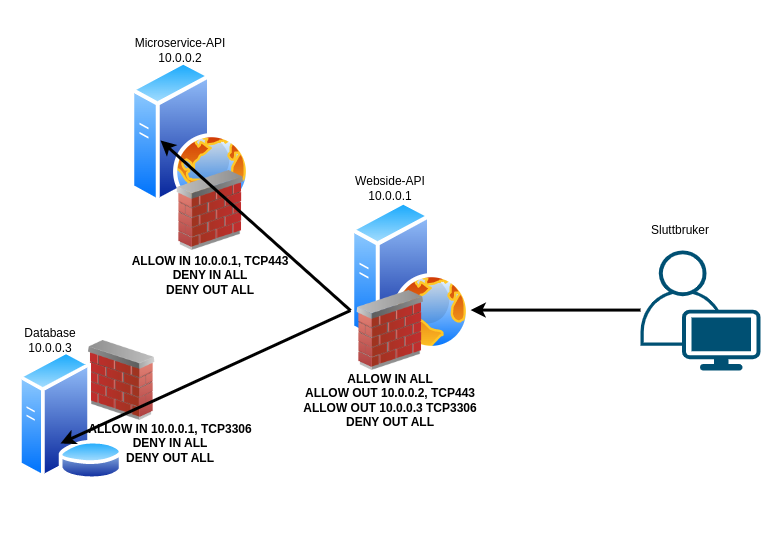

# Networking concepts

Proper network configuration is critical for cloud-only, hybrid and traditional on-premise solutions. The basic premise for this article is handling traffic between servers and services. While this can be a big topic with a lot of complexity, this article will attempt to cover the basic principles of networking. 

- [Networking concepts](#networking-concepts)
    - [Zero trust architecture](#zero-trust-architecture)
    - [Get an overview of the network](#get-an-overview-of-the-network)
    - [Service isolation](#service-isolation)
    - [Configuration](#configuration)

## Zero trust architecture

[Zero trust](https://en.wikipedia.org/wiki/Zero_trust_security_model) has emerged as one of the most important concepts related to networking over the past years. The basic premise is `never trust, always verify.` Assume that any traffic can be monitored by unauthorized personnel, and ensure that all traffic is encrypted and that mechanisms are in place to mitigate such attacks. 

Zero trust can be difficult to retrofit to existing networks and systems, and it requires careful design and planning for a successful implementation. Any systems active in the network must also have the same design philosophy. 


## Get an overview of the network

:::note Summary
Document which IP addresses and ports you expose on any networks, and which services these are related to. Document and keep track of firewall rules, verify that anything unexpected isn't exposed by checking logs and scanning the systems with tools such as nmap. 
:::

Documenting and keeping track over which IP-addresses, ports and protocols an IT system exposes is essential if the goal is to have a secure system. This applies to all projects, both those building something brand new or those working on existing systems. An attacker will map out everything that's exposed in order to probe for weaknesses, so keeping track of this is vital in order to manage the attack surface. There have been multiple examples of successful attacks being initiated through outdated devices or services not supported or maintained, thus becoming vulnerable to exploitation. 

Zero-trust should always be used as a guideline, particularly for new systems. Blocking everything so that nothing is exposed should be the first step, only exposing ports and protocols required by the application. [Isolate](#isolasjon-av-tjenester) systems that don't need to interact and configure a Web Application Firewall (WAF) is this is applicable for the project.

Getting an overview of required ports and connections can be difficult for existing systems, especially you run on-prem or in a hybrid cloud model. Closing exposed ports can also be risky as other systems may use them on a non-frequent basis. If uncertain, check if the customer has a Network Operation Center (NOC) or a Security Operations Center (SOC); these are often able to assist.

Both public and private IP adresses should be scanned, and the scan should be performed multiple times from various places in the network. An organization with eg. uses virtual desktops, VPNs, office networks and networks for production machinery will have a somewhat different routing between these networks, so the scanning should be carried out from within each of them. 

The same advise applies to network only containing eg. virtual resources, especially if the network covers a large IP range. 

There are many different tools that can facilitate mapping. `nmap` is one of the more common tools, and as well as being FOSS it is very capable of scanning IP-ranges and discover open UDP-, TCP- and SCTP-ports. If you have nothing in place, learning and using `nmap` is a good place to start. 

:::caution Warning
The use of active scanning tools such as `nmap` must be approved by the owners of the infrastructure, network and resources you want to scan. If you happen to use `nmap` from a Bouvet laptop and network and want to scan resources located at a client, this may trigger notifications and alerts at the user. If the scan has a large range of ports and IPs and takes a while, internal IT in Bouvet and our ISPs will also react. 
:::

- Find out what you expose
    - Check firewall rules and the network configuration in the immediate vicinity of your system first!
        - Remember that rules may exist on several levels. A [virtual machine](../06_deploye/03_virtual_machines.md) will usually be covered by a network firewall and an OS-level firewall. 
        - Check with the group or organisational unit responsible for operating the network and/or firewalls determine if they use other rules that will affect your services. 
    - Create a list of all ingress- and egress methods used to connect to your service, or which is used by your service in other ways:
        - Internet
        - Internal network
        - Client-VPN
        - Site to site VPN
        - Dedicated fiber carriers or other network connections
    - Check logs for network traffic, preferably in aggregated form to easily spot strange entries.    
    - If needed, use tools such `nmap` to scan for exposed ports and services. 
    - If relevant, look through the existing CRM tools to uncover previous history and documentation of the system. 
- Figure out what you need to expose, and to where. 
    - Verify that you only expose what you intend to!
- Create a diagram showing the network flow with directions, ports and protocols, both as-is and to-be. 
- Use the best practices described below and implement the ones that are relevant.
- Where possible, work with the organizational units responsible for networking; these have a lot of knowledge which can be useful to you!

## Service isolation

:::note Summary
Use a firewall to limit network exposure and network access. Whitelist allowed IPs, never base security on blacklisting. Filter traffic in the application layer if required. 
:::
A _firewall_ is one or more barriers in a network which will reject or drop unwanted traffic. In most cases a firewall will operate on the TCP or IP layers, but a firewall can also operate on the application layer. 

To establish and implement a [zero-trust architecture](https://en.wikipedia.org/wiki/Zero_trust_security_model) all components must be isolated and made available only for the services they should interact with. To accomplish a zero-trust a firewall is required to filter traffic between the components within an application, between applications and between an application and outside networks - both internal and public. If you have an application with eg. a database, a backend API and a web API, firewall rules should be defined for each of them to only allow expected traffic and drop everything else. The diagram below illustrates this. 



- A firewall should always be configured to drop all incoming and outgoing traffic as default. 
    - Whitelist specific IPs or ranges as needed.
    - Always consider if foreign IP-ranges should be whitelisted before doing so. 
    - Only expose ports and protocols required by the application
    - Use a firewall to limit interaction between servers and services - also block internal traffic where not required. 
- Segment the network so that each function lives in separate subnets or VLANs if possible.
- Avoid routing traffic over the public internet - use private endpoints where possible, even for own cloud services. 
- All services which are going to be exposed should be protected by a security mechanism such as a `web application firewall` or an `api gateway`
- Manage the systems that require logins
    - Use a service such as `bastion hosts` where possible
    - Configure just-in-time access to allow access from specific internal IP addresses temporarily if bastion hosts aren't an option. 
    - Never expose protocols such as `ssh`, `rdp` or `vnc` on the public internet, not even if you modify the services to use non-standard ports. 
- Configure a separate DNS-resolver with the required domains for lookup. Ensure that no external DNS-resolvers are used as a fallback.
- Route all HTTP-traffic through a HTTP-proxy.
    - Whitelist required domains 

## Configuration

Network configuration should be automated as much as possible, preferably using a [CI/CD-pipeline](../03_bygge/ci-cd.md).

- Limit access to manual network configuration
    - Implement just-in-time access where possible - ensure that logging is properly set up
    - Limit where the network can be configured from
- Configure the network using Infrastructure as Code (IaC) whereever possible
    - Use source control
        - Use additional security controls on repositories containing network configuration - only allow access to those who really require it for their daily work. 
        - Ensure that the repository configuration cannot be changed without being detected
        - Configure the repository to always require code reviews when modifying the network code
    - Use tools such as `Snyk` to analyze IaC
    - Code should be deployed on a regular and automatic basis - daily should be a minimum
        - Unexpected rules should trigger notifications
        - All unexpected rules should be deleted immediately
        - Comparisons should be made to verify that the deployed code matches the repository
    - Remember to document all rules, regardless of being implemented manually or as code
```
